# Lab —�模��C++ 游��验�
C++17 多模�项目，包� 4 个共享库（core/snake/gomoku/pacman）�一个文本处�模�（chat/�go/）�一�C++ WebSocket 游��务器和一�Vue 3 桌��端�所有游�模�通过 `extern "C"` 6 函数 API 暴露，由 `main.cpp` 和游��务器�`GameModule` 加载器动�加载�
## 目录结�

```
├── CMakeLists.txt        根�建文�├── build.sh              一键�建脚�├── main.cpp              Demo 入�（链�libcore，dlopen 加载游�模��├── start.sh              一键�动脚本（游��务�+ �端�├── backend/
�  └── main.cpp          游� + �天�务器（WebSocket :3001�├── frontend/             Vue 3 + Vite 桌��端
�  └── public/res/       资�文件（图片�视频�音频）
├── module/
�  ├── module.md         模�开�规范（新�模�请�循）
�  ├── game/             游�基础设施（Game基类�Direction�GameModule加载器）
�  ├── core/             并� & 网络工具库（�httpsPostStream��  �  ├── toolbox        URL 解� + JSON 工具函数
�  �  └── netconn       HTTP/WebSocket + HTTPS ��请求
�  ├── snake/            终端贪食蛇游��  ├── gomoku/           终端五�棋游��  ├── pacman/           终端�豆豆游��  ├── chat/             文本处�模�（�调追����  └── go/               围棋游�
├── 3rd/
�  └── win11React/       Win11 React 桌�集�（�选）
└── README.md             本文�```

## 文档索引

- [frontend/README.md](frontend/README.md)
- [module/game/README.md](module/game/README.md)
- [module/core/README.md](module/core/README.md)
- [module/snake/README.md](module/snake/README.md)
- [module/gomoku/README.md](module/gomoku/README.md)
- [module/pacman/README.md](module/pacman/README.md)
- [module/go/README.md](module/go/README.md)
- [module/chat/README.md](module/chat/README.md)

## 模�

| 模� | 库文�| 说� |
|------|--------|------|
| [`game`](module/game/README.md) | `libgame.so` | Game 抽象基类�Direction 工具�GameModule 加载器（dlopen �装�|
| [`core`](module/core/README.md) | `libcore.so` | ThreadPool, Timer, Logger, EventManager, NetConn（HTTP/WebSocket� httpsPostStream（SSE �� HTTPS 请求� toolbox（URL 解� + JSON �列化） |
| [`snake`](module/snake/README.md) | `libsnake.so` | 贪食蛇，终端渲染，方�键�制 |
| [`gomoku`](module/gomoku/README.md) | `libgomoku.so` | 五�棋，15×15 棋盘 |
| [`pacman`](module/pacman/README.md) | `libpacman.so` | �豆豆，方�键�制，�豆得分 |
| [`go`](module/go/README.md) | `libgo.so` | 围棋�9×19 棋盘，数�法 3.75 �贴�|
| [`chat`](module/chat/README.md) | `libchat.so` | 文本处�，通过�调追加"�到输入末�|

游�模��循统一规范：`include/`�`src/`�`test/`�`benchmark/` ��中文 README，`extern "C"` 导出 `game_new`�`game_free`�`game_tick`�`game_is_over`�`game_get_score`�`game_get_state`。`getState()` 使用 `boost::json::object` + `boost::json::serialize()` 生��法 JSON。`chat` 模�采用独立�C API（`chat_new`/`chat_free`/`chat_process`）�
## �赖

- C++17 编译器（GCC 11+�- CMake �3.12
- Boost（url, json, filesystem）�core 模�直�链�，游�模�链�`Boost::json`
- OpenSSL �core 模�链�
- Google Test �独立�建测试�- Google Benchmark �独立�建基准测试�- Node.js �18 ��端（��22+�
## �建���
```bash
# 一键��C++
./build.sh
# 或手动：
mkdir -p build && cd build
cmake .. -DCMAKE_BUILD_TYPE=Release
make -j$(nproc)
cd ..

# �行 demo（链�libcore.so，dlopen 加载游�模��LD_LIBRARY_PATH=build/output/lib ./build/demo

# Demo 输出顺�：NetConn �Chat �Pac-Man �Gomoku �Snake �Go
```

### 独立�建�个模�

```bash
cd module/core     # �snake / gomoku / pacman / chat / go
mkdir build && cd build
cmake .. -DCMAKE_BUILD_TYPE=Release
make tests                    # 编译�元测试
./output/test/tests           # �行测试
make bench                    # 编译基准测试
./output/bench/bench_timer    # �行基准测试
```

### 游��务�
```bash
# �建（已包��make 中）
cd build && make -j$(nproc)

# �行（监�0.0.0.0:3001�LD_LIBRARY_PATH=output/lib ./output/AImeath
```

�务器�供两�WebSocket 端点�- 普通路径（`/`）：游� WebSocket（snake / pacman / gomoku / go�- `/chat`：��WebSocket，��调�DeepSeek API（`deepseek-v4-flash`），支�指令 `/图片`�`/视频`�`/音�`�`/游�xxx`

### �端

```bash
cd frontend
npm install --ignore-scripts   # WSL 下需跳过 esbuild postinstall
npm run dev                    # �动 Vite 开��务器
# 访问 http://localhost:5173/
# 需�游��务器（端�3001）�时��```

�端�Win11 �格的桌��境，包��- 桌�图标网格（贪食蛇��豆豆�五�棋�围棋�Chat 喵）
- �拖动�缩放�最�化/最大化/关闭的窗�（iframe 嵌入�App�- 底部任务�：窗�切�按钮 + 时钟
- �一 App �打开多个独立窗�
- �天页�：��Markdown 渲染，嵌入图�视频/音频/游�

## 一键��
```bash
./start.sh
# 自动�建 C++��动游��务器�3001）和�端�5173�# Ctrl+C 优雅终止所有��```

## 设计�点

- **统一加载模�**：所有游�模�导出相�`extern "C"` 6 函数签�，`GameModule` �装 `dlopen` + `boost::dll` 缓存加载
- **代��用**：`toolbox` 抽� URL 解��JSON 工具函数�core，`backend/main.cpp` �用 `httpsPostStream` ���HTTPS 请求
- **Core 直�链�**：`main.cpp` �`AImeath` 直�链� `libcore.so`（�通过 dlopen），仅游�模�动�加�- **游�状�输�*：`getState()` 使用 `boost::json::object` + `boost::json::serialize()` 生��法 JSON，无需手工拼�和转�- **NetConn**：基�Boost.Asio + ThreadPool 的异�HTTP/WebSocket 客户端，�自动��- **httpsPostStream**：��HTTPS 请求 + SSE 行级�调，OpenSSL 支��0s 超时
- **游��务�*：C++ �生 WebSocket �务器，thread-per-connection 模�，路径路由区分游��天
- **�天�务�*：WebSocket �收用户消� �调用 DeepSeek API ��� `stream_start`/`delta`/`stream_end` �议���端；支�`/图片`�`/视频`�`/音�`�`/游�xxx` 指令

```mermaid
graph LR
A[方形] -->B(圆角)
    B --> C{�件a}
    C -->|a=1| D[结�1]
    C -->|a=2| E[结�2]
    F[横��程图]
```

- **�端**：Vue 3 + vue-router（hash 模�）桌��境，Composition API + `<script setup>`，WebSocket 直��务器（�Vite 代�），Win11 窗�系统（拖�缩放/最�化/最大化/关闭），Markdown 渲染（marked），CSS Grid 渲染游�网格，游��置集中至 `src/config/games.js`，路由自动生�- **WSL 兼容**：`vite.config.js` �`host: '0.0.0.0'` �`cacheDir: 'node_modules/.vite'` 规� UNC 路径问题
